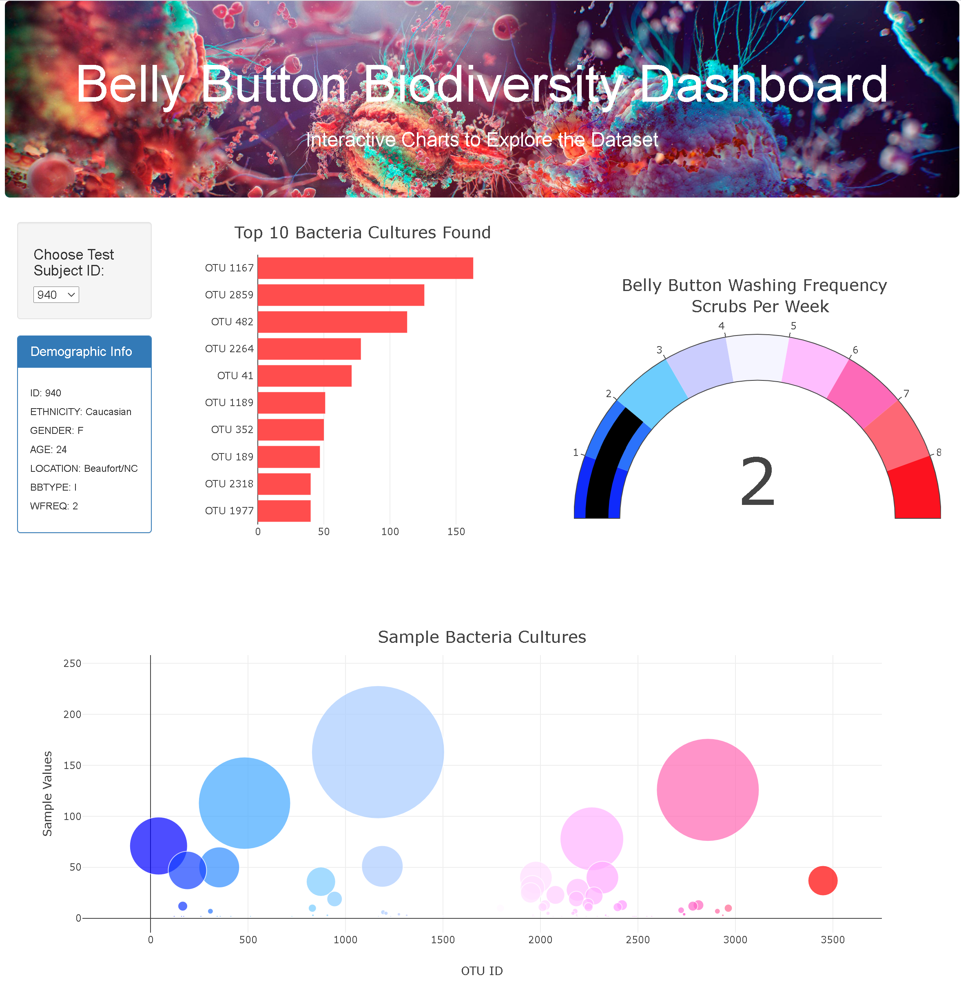
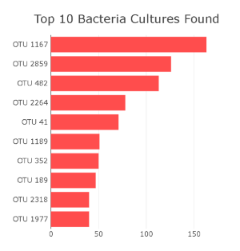
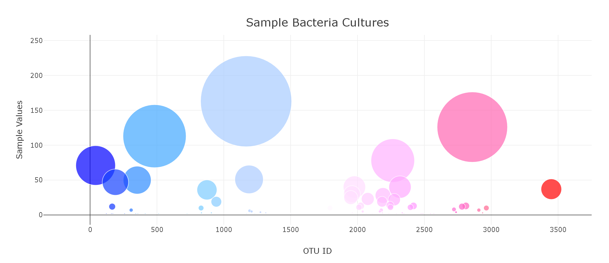
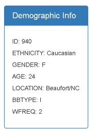
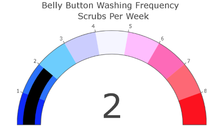

# Plot.ly Homework - Belly Button Biodiversity

Built an interactive dashboard to explore the [Belly Button Biodiversity dataset](http://robdunnlab.com/projects/belly-button-biodiversity/), which catalogs the microbes that colonize human navels.

D3, Plotly, Javascript, HTML, and CSS were used in this exercise.

The final app can be viewed at: https://klharp.github.io/plotly-challenge/

  

## Step 1: Plotly

1. Used the D3 library to read in the provided `samples.json`.

2. Occupied the dropdown menu to allow for selection individual samples to see the data. Sample 940 is the default.

3. Created a horizontal bar chart to display the top 10 OTUs found in each individual sample.

    

4. Created a bubble chart that displays each sample's values by OTU ID.

    

5. Displayed the sample metadata as key-value pairs.

    

## Step 2:  Challenge  

Added a gauge to show the weekly washing frequency of the selected sample.

  

